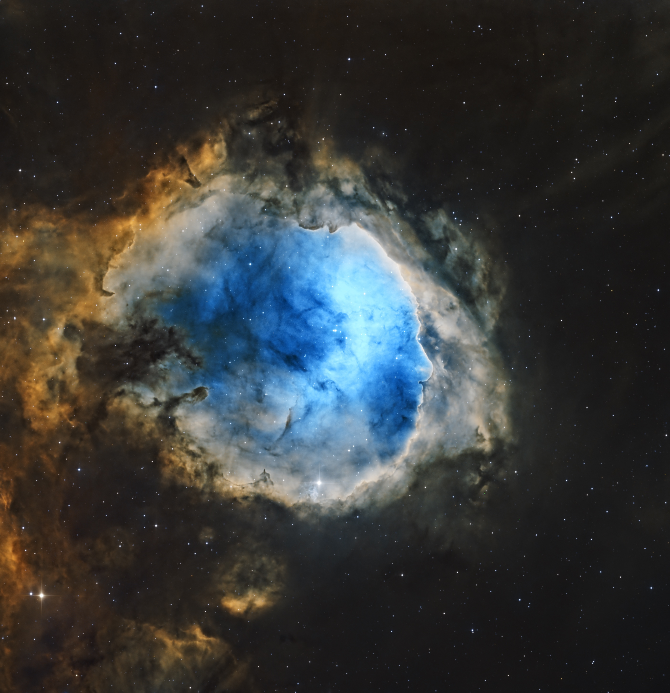

# NGC 3324 - Gabriela Mistral Nebula

## Image Acquisition 

Images are acquired remotely using [Telescope Live](https://telescope.live/).

Telescope Specification:

* Model: Planewave CDK24
* Aperture: 640mm
* Focal Length: 3962mm
* F-ratio: 6.5

Camera Specification:

* Model: FLI PL 9000
* Pixel Size: 12𝞵m
* Pixel Array: 3056 x 3056
* Pixel Resolution: 0.62 arcsec/pixel
* Cooling: -25C in summer, -30C in winter

Frames:

* 26 x 600 seconds, bin 1x1, Astrodon Halpha
* 25 x 600 seconds, bin 1x1, Astrodon OIII
* 25 x 600 seconds, bin 1x1, Astrodon SII
* 6 x 600 seconds, bin 2x2, Astrodon Halpha
* 7 x 600 seconds, bin 2x2, Astrodon OIII
* 6 x 600 seconds, bin 2x2, Astrodon SII

Total of 15 hours 50 minutes.

## Image Analysis

Blink showed the data looks pretty solid. I had to remove only one sub and ended
up with just a bit less than 16 hours of narrowband data.

## Image Processing

All processing is done in [PixInsight](https://pixinsight.com) with final
touches done in [Acorn](https://flyingmeat.com/acorn/).

### Blink Screening

* *Halpha*: Solid data, no trails, just one removal because of focusing issues
* *OIII*: Solid data, no trails, no removals
* *SII*: Solid data, no trails, no removals

### WBPP v2.5.9

1. Reset all
2. Load all lights, data came calibrated so I skipped the calibration part
3. Select the preset for maximum quality and no compromises
4. Reference image to auto
5. Set cosmetic correction for all frames
6. Enable Local Normalization
7. Enable Image Integration
8. Enable Drizzle (Scale = 1, Drop Shrink = 0.9)
8. Enable Autocrop

Executed in 34.22 minutes - no errors.

### Load Master Linear Images

Load the resulting master images and rename them:

* `master_bin1_ha`
* `master_bin1_o3`
* `master_bin1_s2`
* `master_bin2_ha`
* `master_bin2_o3`
* `master_bin2_s2`

### Linear Fit

To make all sub-frames statistically matching, apply LinearFit with `master_bin2_s2`
as reference.

### Dynamic Background Extraction

Apply DBE to master images, where the sampling is per filter not binning e.g.
the same model to both `master_bin1_ha` and `master_bin2_ha`.

### Create the Synthetic Luminance Image and Finish the Linear Processing on It

With three master images, we can use ImageIntegration to create the synthetic
Luminance image.

1. I saved the three master images to disc.
2. Set up ImageIntegration to use those files, averaging for integration,
   and disabled rejection.
3. Run ImageIntegration and rename the image.
4. Run BlurXTerminator
    - Automatic PSF
    - Sharpen Stars=0.25
    - Adjust Star Halos=0.10
    - Sharpen Nonstellar=0.75
5. Run NoiseXTerminator with strength of 0.6 and detail 0.30 to enhance detail.

### Process the Linear Master Luminance Image

Take the Lum image nonlinear using GHS (GeneralizedHyperbolicStretch).

Create a starless version of the Lum image using StarXTerminator with Unscreen
Stars enabled. Use CloneStamp on the starless image to fix any star remnants.

Create a range mask (Smooth = 15.0, Lower Limit = 0.24) with Lightness option
enabled. Apply the mask, then increase contrast with an S-shaped CurvesTransformation.

Create a GAME mask that uses multi point gradients to target interesting
features of the nebula. Apply the mask and run LocalHistogramEqualization (radius = 162,
contrast limit = 2.0, amount = 0.46, histogram = 8-bit).

### Create and Process the Initial Color SHO Image

We have two sets with master images - one with BIN1 and another for BIN2 images.
Each set contains three images - one for each filter. Duplicate the images in the
BIN2 set to disk. After that we end up with three image files per filter:

* `master_bin1_ha`
* `master_bin2_ha`
* `master_bin2_ha`
* etc.

Now we can use ImageIntegration to create a master file for each filter.

Combine the resulting master images with the ChannelCombination tool to create the
master SHO image.

Remove stars with StarXTerminator. Then apply Bill Blanschan's SHO Normalizer script
with C-Normalization, SCNR and Mask options enabled while SIIBoost is set to 2.0.

Go nonlinear with incremental applications of GeneralizedHyperbolicStretch.

Run SCNR with Green Removal at 0.85. Invert the image, what was magenta is now
green. Run SCNR with Green Removal at 0.85 again to remove any residual magenta.
Invert back the image.

Now use CurvesTransformation to do a global boost for both contrast
and color saturation.

### Create the Color Masks for Adjusting Our Image

Run Bill Blanschan's Blue Color Mask script. Use CurvesTransformation to
boost contrast, then apply blur.

Create a Green Color mask using Bill Blanschan's script. Use CurvesTransformation to
boost contrast, then apply blur.

Create a Yellow Color mask using Bill Blanschan's script. Use CurvesTransformation to
boost contrast, then apply blur.

Use GAME to create a GAME mask over interesting nebula structures.

### Do Initial Mask Processing

Apply the Green Mask to enhance the "Golden" portions of the SHO palette:
* Adjust with CurvesTransformation
* Enhance the details in the area using LocalHistogramEqualization
  with Kernel Radius = 50, Contrast Limit = 2, Amount = 0.40,
  and Histogram Resolution = 8bit.

Apply the Blue Mask:
* Adjust with CurvesTransformation
* Enhance the details in the area using LocalHistogramEqualization
  with Kernel Radius = 50, Contrast Limit = 2, Amount = 0.50,
  and Histogram Resolution = 8bit.

Apply the Yellow Mask:
* Adjust with CurvesTransformation
* Enhance the details in the area using LocalHistogramEqualization
  with Kernel Radius = 50, Contrast Limit = 2, Amount = 0.50,
  and Histogram Resolution = 8bit.

### Create a Dark Structure Mask and Use It

I wanted to make the dark structures pop a bit more. Rather than
just using the DarkStructureEnhance stript, I decided to use it
to create a mask, which I then manipulate.

1. Run the DarkStructureEnhance script with it's defaults and
   extract a mask.
2. Enhance the mask with CurvesTransformation.
3. Blur with Bill Blanschan's Blur.
4. Apply a final CurvesTransformation.

Apply the mask, then do selective contrast sharpening with LocalHistogramEqualization with Kernel Radius = 64, Contrast Limit = 2, Amount = 0.66, and Histogram Resolution = 8bit.

### Final Tweaks to the Starless Image

Apply NoiseXTerminator with Denoise = 0.65 and Detail = 0.15.

Apply the GAME mask and do LocalHistogramEqualization with Kernel Radius = 50, Contrast Limit = 2, Amount = 0.40, and Histogram Resolution = 8bit.

Apply the Blue Mask, then do LRGBCombination where for L put the Lum
image and disable the rest.

Run SCNR with Amount = 0.5, Invert, then run SCNR again. Invert back.

### Process the Stars

Adjust the Stars Only image to reduce star intensity and size then boost the saturation using CurvesTransformation.

### Add the Stars Back

Use PixelMath and a screening equation:

    ~((~SHO_starless)*(~SHO_stars))

---

# Final Image

